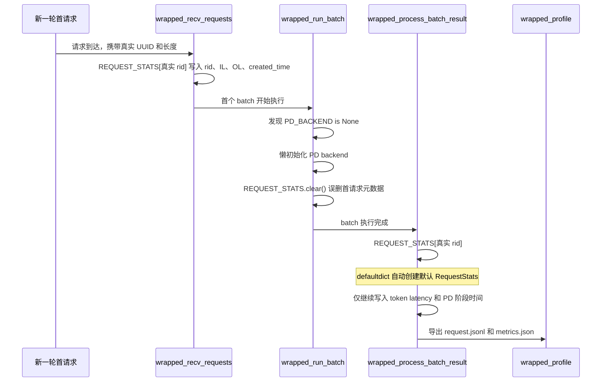

# HiSim PD 分离 `1x1` 特殊请求 BUG 报告

**影响模块：** HiSim PD Disaggregation Simulation  
**代码版本：** `49b144b`（问题由 `61ce9f4` 中的状态清理逻辑引入）  
**调查日期：** 2026-07-27  
**状态：** 根因已定位，尚未修改

---

## 1. 问题摘要

在同一个 HiSim server 上连续运行 PD 分离 benchmark 时，从第二轮开始，部分 `request.jsonl` 会出现一条特殊记录：

```json
{
  "rid": "",
  "input_length": 1,
  "output_length": 1,
  "created_time": 0
}
```

该记录并非真实的 `1 token input + 1 token output` 请求，而是首个真实请求的 `RequestStats` 元数据被清除后，由 `defaultdict` 重新创建的默认统计对象。

本批数据中，PD 分离共有 67 个 case 出现该问题；PD 合并没有出现。

---

## 2. 触发条件

同时满足以下条件时触发：

1. 配置启用 PD 分离，即 `disagg.enabled=true`。
2. 同一个 server 连续执行多轮 benchmark/profile。
3. 上一轮结束时 `wrapped_profile()` 关闭 PD backend，并将 `PD_BACKEND` 设为 `None`。
4. 下一轮首个请求已经完成统计初始化，首个 batch 才在 `wrapped_run_batch()` 中懒初始化 PD backend。

新 server 启动后的第一轮通常正常，因为 backend 会在 Scheduler 初始化阶段创建，此时还没有请求统计可被误删。

---

## 3. BUG 产生过程



### 3.1 首请求统计先被正确初始化

`wrapped_recv_requests()` 使用真实 `req.rid` 创建统计记录，并写入真实输入长度、输出长度和到达时间：

```python
req_stats = C_SchedulerHook.REQUEST_STATS[req.rid]
req_stats.rid = req.rid
req_stats.input_length = len(req.input_ids)
req_stats.output_length = req.sampling_params.max_new_tokens
req_stats.created_time = simulation_args["created_time"]
```

位置：`hisim/src/hisim/simulation/sglang/sglang_hook.py:918-935`

### 3.2 首个 batch 懒初始化时误删统计

上一轮 profile 已将 `PD_BACKEND` 设为 `None`。下一轮首个 batch 进入 `wrapped_run_batch()` 后触发懒初始化，并执行：

```python
C_SchedulerHook.PD_REQUEST_STATES.clear()
C_SchedulerHook.REQUEST_STATS.clear()
```

位置：`hisim/src/hisim/simulation/sglang/sglang_hook.py:1068-1107`

此时首请求已经完成步骤 3.1，因此 `REQUEST_STATS.clear()` 删除的是本轮有效请求，而不是上一轮残留状态。

### 3.3 `defaultdict` 静默创建默认对象

`REQUEST_STATS` 的定义为：

```python
REQUEST_STATS: dict[str, RequestStats] = defaultdict(RequestStats)
```

首 batch 完成后，结果处理代码再次访问 `REQUEST_STATS[req.rid]`。由于原记录已被删除，`defaultdict` 自动创建新的 `RequestStats`，默认值为：

```python
rid = ""
input_length = 1
output_length = 1
created_time = -1
```

位置：

- `hisim/src/hisim/simulation/sglang/sglang_hook.py:587`
- `hisim/src/hisim/simulation/types.py:54-63`
- `hisim/src/hisim/simulation/sglang/sglang_hook.py:1830-1834`

随后 token latency 和 PD 阶段时间仍会按字典中的真实 UUID key 写入该对象，所以异常记录虽然显示 `output_length=1`，却仍包含 1024 或 4096 个 `gen_token_latencies`。

### 3.4 时间对齐将 `created_time=-1` 变成 `0`

导出前，统计记录按 `created_time` 排序。默认对象的 `-1` 成为最早时间，并被选为时间原点：

```python
min_created_time = metrics_stats[0].created_time
item.created_time -= min_created_time
```

因此异常记录最终表现为：

```text
created_time: -1 - (-1) = 0
pd_arrival_time: 0 - (-1) = 1
```

位置：`hisim/src/hisim/simulation/sglang/sglang_hook.py:1970-2010`

---

## 4. 为什么仅 PD 分离出现

PD 合并不会进入 `PD_BACKEND` 懒初始化分支，因此不会在首 batch 中调用这次 `REQUEST_STATS.clear()`。

| 模式 | 检查 case 数 | 异常 case 数 |
|---|---:|---:|
| PD 分离 | 72 | 67 |
| PD 合并 | 36 | 0 |

PD 分离中正常的 case 都是对应 server 的第一轮运行或单独重跑。以 P2D4 为例：

- `rr_1_il_1024_ol_4096` 是该 server 的第一轮，正常。
- `rr_1_il_1024_ol_1024` 是之后单独重跑，正常。
- 两者之间连续运行的 16 个 case 全部异常。

---

## 5. 数据影响

该问题不只是 `request.jsonl` 的显示错误，异常对象会进入 `calc_metrics()`，因此 `metrics.json` 同样受到污染。

主要影响包括：

1. 首个真实请求的输入和输出 token 数被按 `1/1` 统计。
2. 每个异常 case 的 `total_output` 少算 `目标输出长度 - 1` 个 token。
3. TTFT、TPOT、ITL、E2E 和对应分位数混入一条元数据错误的请求。
4. 吞吐率使用了错误的总 token 数。
5. 默认时间原点 `-1` 使其他请求的绝对时间整体增加 1 秒，但同一请求内的大部分时间差保持不变。

本批四组 PD 分离实验中，输出 token 累计少算：

| 实验 | 异常 case | 少算 output token |
|---|---:|---:|
| P1D1 | 17 | 45,039 |
| P2D2 | 17 | 45,039 |
| P2D4 | 16 | 40,944 |
| P4D2 | 17 | 45,039 |

---

## 6. 根因结论

直接根因是生命周期边界错误：

> `REQUEST_STATS.clear()` 同时被用于 Scheduler/backend 的旧状态清理和当前 benchmark 的请求统计管理，但在 `wrapped_run_batch()` 懒初始化阶段调用时，本轮首请求已经进入统计系统。

`defaultdict(RequestStats)` 又掩盖了记录被删除的问题，使代码没有报错，而是生成一个字段合法但语义错误的默认对象。

相关清理逻辑由提交 `61ce9f4` 加入，原意是避免 backend 重建时残留旧请求状态，但没有区分 Scheduler 初始化与首 batch 懒初始化两个不同的生命周期阶段。

---

## 7. 建议的修复与验证方向

本报告不包含代码修改。后续修复建议覆盖以下原则：

1. PD backend 懒初始化不得清除本轮已经建立的 `REQUEST_STATS`。
2. backend 状态与 benchmark 请求统计应明确分离生命周期。
3. 避免使用 `defaultdict` 静默创建正式请求统计，或在导出前校验 `rid` 和请求长度。
4. 增加同一 server 连续执行两轮 PD benchmark 的回归测试。
5. 测试应断言每条记录 `rid` 非空，且 IL/OL 与 workload 一致。

修复后需要重新生成受影响的 67 个 PD 分离 case；现有 `metrics.json` 不应继续用于正式性能比较。
