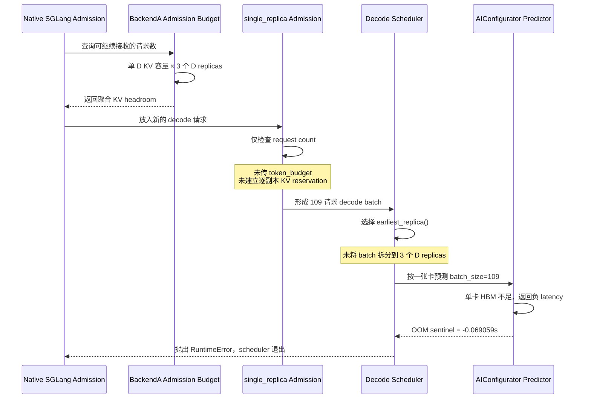

# HiSim PD 分离 P1D3 Decode OOM BUG 报告

**影响模块：** HiSim PD Disaggregation Simulation / Backend A  
**代码版本：** `49b144b`（问题由该版本新增的 KV-aware admission 逻辑暴露）  
**模型：** Qwen/Qwen3-8B（FP16 权重，FP16 KV Cache）  
**硬件模型：** NVIDIA RTX PRO 6000 Blackwell Server Edition  
**调查日期：** 2026-07-27  
**状态：** 根因已定位，尚未修改

---

## 1. Executive Summary

在 HiSim 新版代码中运行 PD 分离拓扑 `P1D3`（Prefill replicas=1、Decode replicas=3）时，AIConfigurator 在 decode latency estimation 阶段返回负数 OOM sentinel，随后 HiSim 主动抛出 `RuntimeError`，SGLang scheduler 子进程退出：

```text
RuntimeError: AIConfigurator predictor returned a negative decode latency
(OOM sentinel): result=-0.069059s batch_size=109
max_past_kv=6406 mean_past_kv=5078.1
```

问题的直接原因不是实际 GPU CUDA OOM，也不是 `decode_kv_capacity_per_replica` 没有构造或透传，而是 `single_replica` decode queue mode 下存在两套不一致的容量语义：

1. Native admission 按 `单个 D 副本 KV 容量 × D 副本数` 计算聚合空间。
2. 实际 decode predictor 调用没有把 batch 拆到 3 个 D 副本，而是把整个 batch 送入最早空闲的一个 D 副本。
3. `single_replica` admission 只检查 request count，不检查该目标副本的 KV token headroom。

因此，P1D3 中一批 109 个请求能够通过“三张 D 卡聚合容量”的 admission，却在“一张 D 卡”的 predictor 中超过单卡显存容量。

该问题只在 `decode.replicas > 1` 时产生容量放大。此前的 P3D1 实验只有一个 D 副本，错误公式乘以 1 后与单卡容量相同，因此没有触发异常。

---

## 2. 测试环境

### 2.1 软件栈

| 项目 | 配置 |
|---|---|
| HiSim 仓库 | `tair-kvcache/hisim` |
| HiSim commit | `49b144b9fd48a22d4730d1d0180a228f87b86f21` |
| SGLang | `0.5.10` |
| AIConfigurator | `aiconfigurator-e0735cc` |
| Python | 3.13 virtual environment |
| Simulation backend | `single_process` |
| Decode queue mode | `single_replica` |

### 2.2 P1D3 配置

配置文件：`tair-kvcache/hisim/tools/pd_disagg_rtx6000_sglang_0_5_10.json`

```json
{
  "disagg": {
    "enabled": true,
    "backend": "single_process",
    "decode_queue_mode": "single_replica",
    "prefill": {
      "tp_size": 1,
      "replicas": 1
    },
    "decode": {
      "tp_size": 1,
      "replicas": 3
    }
  }
}
```

这里的 `replicas=3` 表示 3 个独立的 D service replicas，不是 TP=3，也不是 DP=3。每个 D replica 都由独立的单卡容量模型约束。

### 2.3 Benchmark 参数

```text
num_prompts = 200
request_rate = 1 / 8 / 64
input_length = 1024 / 4096 / 16384
output_length = 1024 / 4096
random_range_ratio = 1
chunked_prefill_size = 4096
```

本次异常出现在高并发、长生命周期请求逐渐累积后，decode batch 达到 109 个请求时。

---

## 3. 报错现象

关键日志如下：

```text
2026-07-27 12:46:35 WARNING [hisim] Out of memory detected during estimation.

RuntimeError: AIConfigurator predictor returned a negative decode latency
(OOM sentinel): result=-0.069059s batch_size=109
max_past_kv=6406 mean_past_kv=5078.1.
Decode admission should have refused this batch via
 decode_kv_capacity_per_replica before reaching the predictor.
```

调用链：

```text
sglang_hook.wrapped_run_batch
  -> pd_runtime.decode_batch_latency
    -> BackendA.try_admit_decode_batch
      -> AICPredictorAdapter.predict_decode_seconds
        -> AIConfigurator.predict_infer_time
          -> OOM sentinel
```

之后出现的：

```text
SIGQUIT received
Killed
Exit Code: 137
```

是 scheduler 抛出异常后触发的子进程退出和进程清理结果，不代表宿主机发生了真实 CUDA OOM。真正的首个错误是 AIConfigurator 对模拟 batch 给出的 OOM sentinel。

---

## 4. 预期行为与实际行为

### 4.1 预期行为

对于 3 个独立 D replicas，应满足以下任一语义：

1. **逐副本路由：** 将 decode 请求拆分成 3 个 replica-local batch，每个 batch 分别检查本副本 KV 容量并调用 predictor。
2. **单副本 batch：** 如果一个 scheduler batch 始终只交给一个 D replica，则 admission 只能按一个 D replica 的 KV 容量放行。

无论采用哪种语义，都不能使用 3 个副本的聚合容量放行请求，再将完整 batch 交给一张卡。

### 4.2 实际行为

当前 `single_replica` 模式组合了两种互相冲突的语义：

| 阶段 | 当前使用的容量语义 |
|---|---|
| Native request admission | 3 个 D replicas 的聚合 KV 容量 |
| Decode targeted admission | 只检查 request count，不检查 KV tokens |
| Decode batch 执行 | 完整 batch 交给最早空闲的 1 个 D replica |
| AIConfigurator OOM 检查 | 按 1 个 D replica 的真实 HBM 容量 |

因此 admission 与 execution 对“这批请求将占用几张卡”的理解不一致。

---

## 5. BUG 产生过程



---

## 6. 代码级根因

### 6.1 单副本 KV 容量已经正确构造

`pd_factory.py` 使用 decode role 的设备、TP、PP、dtype 和 scheduler 参数计算单个 D replica 的 KV token 容量：

```python
decode_kv_capacity_per_replica = estimate_kv_cache_pool_capacity(
    model, decode_hw, decode_role_sched
)
```

随后该值被写入 `DisaggPredictors`：

```python
return DisaggPredictors(
    ...,
    decode_kv_capacity_per_replica=decode_kv_capacity_per_replica,
)
```

相关位置：

- `hisim/src/hisim/simulation/pd_factory.py:209-226`
- `hisim/src/hisim/simulation/pd_factory.py:250-266`

因此，报错文本中“check that the bundle wires ... through”是通用诊断提示，不是本次故障的真实原因。

### 6.2 Admission budget 无条件乘以 D 副本数

`available_admission_budget()` 将单副本容量乘以整个 decode pool size：

```python
total_kv_capacity = (
    self._decode_kv_capacity_per_replica * self.decode_pool_size()
)
```

相关位置：`hisim/src/hisim/simulation/pd_backend_a.py:547-557`

该公式对于真正执行逐副本分流的 `per_replica_queue` 是合理的，但对于当前不拆分 batch 的 `single_replica` 模式不成立。

正确的容量关系取决于执行方式：

$$
C_{admission}=
\begin{cases}
C_D \times N_D, & \text{batch 会按 D replica 拆分}\\
C_D, & \text{完整 batch 只交给一个 D replica}
\end{cases}
$$

当前 P1D3 使用了第一行的 admission 容量，却执行了第二行的 batch 调度。

### 6.3 `single_replica` admission 没有 KV token gate

`admit_decode_single_replica()` 只计算剩余 request count：

```python
available = max(
    0,
    self._max_running_per_replica
    - len(self._single_decode_running_rids),
)
admitted = self._controller.admit_decode_targeted(
    rids, now, max_count=available
)
```

这里没有传入：

- `token_budget`
- `token_cost`
- 目标 replica 的 KV headroom

也没有调用 `_reserve_decode_kv()`。

相关位置：`hisim/src/hisim/simulation/pd_backend_a.py:559-570`

配置又没有显式设置较小的 `max_running_per_replica`，默认 request-count 上限接近无限，因此无法依靠 request count 阻止长上下文 batch。

### 6.4 完整 batch 最终只送入一张 D 卡

`try_admit_decode_batch()` 只有在 `per_replica_queue` 模式下才调用逐副本拆分路径：

```python
if self._decode_queue_mode == "per_replica_queue":
    return self._try_admit_decode_batch_per_replica(reqs, now)
```

`single_replica` 路径则直接选择一个最早空闲副本：

```python
idx, free_at = self._decode_pool.earliest_replica()
past_kv = [int(r.current_past_kv_length) for r in reqs]
dur = self._bundle.decode.predict_decode_seconds(
    batch_size=len(reqs), past_kv_length=past_kv
)
```

相关位置：`hisim/src/hisim/simulation/pd_backend_a.py:703-732`

因此 `decode.replicas=3` 没有把 109 个请求拆成约 3 个局部 batch；AIConfigurator 收到的仍是一个 `batch_size=109` 的单卡预测请求。

### 6.5 KV-aware admission 的覆盖不完整

逐副本 KV gate 已在 `admit_decode_for_replica()` 中实现：

```python
token_budget = self.decode_replica_kv_headroom(replica_idx)
token_cost = self._decode_token_cost
admitted = self._controller.admit_decode_targeted(
    rids,
    now,
    max_count=capacity,
    token_budget=token_budget,
    token_cost=token_cost,
)
```

但这段逻辑仅由 `per_replica_queue` 路径使用。现有回归测试中的关键 KV capacity 用例也都使用 `per_replica_queue`，没有覆盖：

```text
decode_queue_mode = single_replica
decode_replicas > 1
decode_kv_capacity_per_replica != None
```

所以该组合的容量语义错误没有被测试发现。

---

## 7. 数值验证

### 7.1 单个 D replica 的容量

使用当前 Qwen3-8B、TP=1、PP=1、FP16 KV 和 RTX PRO 6000 配置，通过现有 `estimate_kv_cache_pool_capacity()` 计算：

| 参数 | 数值 |
|---|---:|
| KV bytes per token | 147,456 bytes |
| 单 D KV token 容量 | 约 54 万 tokens |
| 单 D 可用 KV 空间 | 约 74 GiB |

具体容量随 `mem_fraction_static` 略有变化。例如：

| `mem_fraction_static` | 单 D KV token 容量 |
|---:|---:|
| 0.88 | 532,328 |
| 0.895 | 约 543,468 |
| 0.90 | 547,182 |

### 7.2 异常 batch 的实时 KV footprint

异常日志给出：

```text
batch_size = 109
mean_past_kv = 5078.1
max_past_kv = 6406
```

该批次仅 past KV 的近似 token 总数为：

$$
109 \times 5078.1 \approx 553,513\text{ tokens}
$$

按照 147,456 bytes/token 计算：

$$
553,513 \times 147,456 \approx 76.0\text{ GiB}
$$

该值已经超过 `mem_fraction_static=0.895` 下约 543,468 tokens 的单 D KV pool；同时 predictor 还需要计算 weights、activations 和 runtime overhead，因此返回 OOM sentinel 与模型容量一致。

### 7.3 为什么错误 admission 会放行 109 个请求

对于 `IL=4096, OL=4096`，代码使用最坏情况预留每个请求的完整生命周期 KV：

$$
C_{request}=4096+4096=8192\text{ tokens}
$$

109 个请求的 reservation 为：

$$
109 \times 8192=892,928\text{ tokens}
$$

P1D3 错误使用的聚合 D 容量约为：

$$
3 \times 543,468=1,630,404\text{ tokens}
$$

因此：

$$
892,928 < 1,630,404
$$

Native admission 认为 109 个请求仍然可以进入系统。但执行时它们没有分到三张 D 卡，而是作为一个 batch 进入一张卡，最终触发 OOM。

---

## 8. 为什么 P1D3 暴露，而 P3D1 没有

P1D3 与 P3D1 的总副本数都是 4，但 decode 容量只取决于 D replica 数量，而不是 P+D 总数。

| 拓扑 | P replicas | D replicas | Admission 认为的 D KV 容量 | Predictor 单次实际容量 |
|---|---:|---:|---:|---:|
| P3D1 | 3 | 1 | $1 \times C_D$ | $1 \times C_D$ |
| P1D3 | 1 | 3 | $3 \times C_D$ | $1 \times C_D$ |

P3D1 中错误公式乘以 1 后恰好仍然正确，所以单 D 的 KV admission 会及时停止接收新请求，让后续请求在 prefill/decode queue 中等待。

P3D1 实验目录：

```text
cases_same_seed_1-P3D1-tp1-dp1-replica3-PDdisagg
```

18 个 case 均完整生成，并且产物时间为 2026-07-27 11:08，晚于 `49b144b`，因此不是旧代码版本绕过了问题。

从 P3D1 请求产物中的 `pd_decode_start_time` 和 `pd_decode_end_time` 计算得到：

| Case | 完成请求数 | 最大同时 decode 请求数 |
|---|---:|---:|
| `rr=64, il=4096, ol=4096` | 200 | 65 |
| `rr=64, il=16384, ol=4096` | 200 | 25 |

这两个峰值与单 D KV 容量约束一致：

- `4096+4096=8192 tokens/request`，单卡只能容纳约 60 多个请求。
- `16384+4096=20480 tokens/request`，单卡只能容纳约 20 多个请求。

P3D1 的高负载结果中也存在明显排队。例如 `rr=64, il=4096, ol=4096`：

| 指标 | 数值 |
|---|---:|
| completed | 200 |
| mean prefill queue | 264,401.9 ms |
| mean decode queue | 5,106.7 ms |
| mean E2E | 498,505.6 ms |

这说明 P3D1 并不是负载较轻，而是唯一 D replica 的容量约束产生了预期背压。增加 3 个 P replicas 只能提高或改变 prefill 侧并行度，不会增加 decode 卡的 HBM。

---

## 9. 精确触发条件

该 BUG 需要同时满足以下主要条件：

1. `disagg.enabled=true`。
2. 使用 Backend A：`disagg.backend=single_process`。
3. 使用 `decode_queue_mode=single_replica`。
4. `decode.replicas > 1`。
5. `decode_kv_capacity_per_replica` 成功计算，native admission 因此按 KV 容量控制请求。
6. 工作负载使已 admission 请求的总 reservation 超过一个 D replica 的容量，但没有超过所有 D replicas 的错误聚合容量。
7. 这些请求在同一个 native decode batch 中被送入 predictor。

可用公式描述核心触发窗口：

$$
C_D < C_{batch} \leq N_D \times C_D,\quad N_D>1
$$

其中：

- $C_D$：单个 D replica 的容量。
- $N_D$：D replica 数量。
- $C_{batch}$：最终送入一次单卡 predictor 调用的 batch footprint。

以下因素会提高触发概率：

- 长 input length。
- 长 output length，因为 admission 按 `input + max_output` 预留。
- 高 request rate。
- 较大的 `num_prompts`。
- decode 服务时间较长，导致活跃请求持续累积。
- 配置未设置合理的 `max_running_per_replica` request-count 上限。

---

## 10. 不同配置的风险矩阵

| Queue mode | D replicas | 本 BUG 风险 | 原因 |
|---|---:|---|---|
| `single_replica` | 1 | 不触发该容量倍增问题 | 聚合容量等于单卡容量 |
| `single_replica` | >1 | 高风险 | Admission 按多卡，execution 按单卡 |
| `per_replica_queue` | 1 | 不触发该问题 | 逐副本 KV gate 与单卡 execution 一致 |
| `per_replica_queue` | >1 | 当前设计路径不受该问题影响 | 请求按 replica bucket 拆分并逐副本 gate |

注意：表中“本 BUG 风险”只评价本报告定位的容量口径错误，不代表对应模式不存在其他调度或性能建模问题。

如果 `decode_kv_capacity_per_replica=None`，KV-aware admission 会完全关闭。这属于另一种容量保护缺失场景，不是本次“多 D 容量被错误聚合”的同一触发路径。

---

## 11. 影响范围

### 11.1 功能影响

1. Scheduler 进程在 benchmark 中途退出。
2. 当前 case 无法生成完整 metrics 和 request artifacts。
3. 后续 client case 因 server 已退出而无法继续。
4. 自动化 sweep 可能只留下部分结果，容易被误认为 client 或系统资源故障。

### 11.2 性能结果影响

即使某些 P1Dn case 尚未达到 OOM sentinel，只要 `single_replica + D replicas > 1`，其 admission 和 execution 语义已经不一致：

- 系统可能允许过多请求进入 decode。
- decode queue wait 可能被低估。
- batch size 可能大于任一真实 D replica 可承载范围。
- TPOT、E2E、throughput 可能基于不真实的单卡超大 batch 得到。

因此，不能只把“是否崩溃”作为数据可信标准。所有使用该组合生成的结果都应在修复后重新验证。

### 11.3 当前数据建议

- P3D1 数据不受本次多 D 容量倍增问题影响。
- P1D3 及其他 `P1D2/P1D4/...`、且使用 `single_replica` 的数据需要重新审查。
- 已发生 OOM sentinel 的 case 不能用于性能比较。
- 未崩溃的多 D `single_replica` case 也需要检查最大 batch footprint 是否超过单 D 容量。

---

## 12. 排除项

调查已排除以下原因：

### 12.1 不是实际 CUDA OOM

运行设置了：

```bash
export SGLANG_USE_CPU_ENGINE=1
```

OOM 来自 AIConfigurator 的模拟 memory check。负 latency 是其 OOM sentinel，不是 CUDA allocator 抛出的异常。

### 12.2 不是容量字段未透传

`pd_factory.py` 已成功计算并设置 `decode_kv_capacity_per_replica`。如果该字段为 `None`，当前 `available_admission_budget()` 根本不会进入 KV 聚合计算分支。

### 12.3 不是 P3D1 使用旧版本

P3D1 产物生成时间晚于当前 `49b144b` commit，且所有 18 个 case 均完成。

### 12.4 不是 HiCache I/O backend 导致

异常发生在 decode predictor 的 HBM memory estimation；HiCache backend、磁盘带宽和 KV transfer bandwidth 不决定这次单卡 decode batch 的 weights + activations + KV 容量检查结果。

### 12.5 不是 `decode.replicas=3` 等于 TP=3

当前配置中 `decode.tp_size=1`。三个 replicas 表示三套独立单卡 decode 服务，不能在一次单卡 predictor 调用中共享 HBM。

---

## 13. 代码历史

提交 `49b144b` 的目标是：

1. 为 PD 分离增加 P/D KV Cache Pool 容量隔离。
2. 根据 replica 数量放大 shared native KV pool。
3. 增加 decode KV-aware admission，避免 AIConfigurator OOM sentinel 污染模拟时钟。

该提交正确实现了 `per_replica_queue` 的逐副本 KV reservation，但没有给已有的 `single_replica` admission 增加对等的 KV token gate。同时，新的 aggregate admission budget 无条件乘以 decode pool size，于是形成此次不一致。

从 `git blame` 可见：

- 聚合 KV admission 逻辑由 `49b144b` 引入。
- `admit_decode_single_replica()` 沿用更早的纯 request-count admission。
- `try_admit_decode_batch()` 的 single-replica 整批执行逻辑也早于本次 KV-aware admission。

因此，本 BUG 本质上是新容量保护逻辑与旧 single-replica 调度语义组合后的兼容性缺口。

---

## 14. 建议的修复原则

本报告不包含代码修改。后续修复需要先明确 `single_replica` 的产品语义，再选择以下方向之一。

### 方向 A：保持完整 batch 只使用一个 D replica

如果 `single_replica` 的定义是“一次 native batch 只在一个 D replica 上运行”，则：

1. `available_admission_budget()` 在该模式下只能使用一个 D replica 的 KV 容量。
2. `admit_decode_single_replica()` 必须接收 `token_budget/token_cost`。
3. 必须为选中的 D replica 建立和释放 KV reservation。
4. 不能仅依赖 request-count 上限。

### 方向 B：让多个 D replicas 真正并行承载 batch

如果期望 P1D3 使用三张 D 卡的聚合容量，则：

1. 请求必须绑定到具体 D replica。
2. Decode batch 必须拆成 replica-local buckets。
3. 每个 bucket 必须独立调用 predictor。
4. 每个 replica 必须维护独立 KV reservation、running count 和 clock。
5. Native admission 的聚合容量才能合法地等于 $C_D \times N_D$。

当前 `per_replica_queue` 已经更接近方向 B。修复时应避免在 `single_replica` 中再实现一套语义近似但状态管理不同的多副本调度。

---

## 15. 建议的回归测试

至少增加以下测试矩阵：

| Test | Queue mode | D replicas | KV capacity | 预期 |
|---|---|---:|---:|---|
| 单 D 基线 | `single_replica` | 1 | 100 | 总 admission 不超过 100 tokens |
| 多 D single 模式 | `single_replica` | 3 | 100/replica | 若整批单卡执行，总 admission 不超过 100 |
| 多 D per-replica 模式 | `per_replica_queue` | 3 | 100/replica | 聚合可达 300，但每个 bucket 不超过 100 |
| 单请求超大 | 两种模式 | 1/3 | 100 | 单请求 cost>100 时不得进入 predictor |
| 完成后释放 | 两种模式 | 1/3 | 100 | 请求完成后 headroom 恢复 |
| Retract/terminate | 两种模式 | 1/3 | 100 | reservation 无泄漏、无重复释放 |
| Predictor guard | 两种模式 | 1/3 | 100 | 合法 admission 后 predictor 永不收到 OOM batch |

还应增加一个接近本次现场的集成回归：

```text
P1D3
single_process
single_replica
Qwen3-8B FP16
IL=4096
OL=4096
num_prompts=200
request_rate=64
```

测试需要断言：

1. 200 个请求全部完成。
2. server 不退出。
3. 每次 predictor 调用的 batch footprint 不超过目标 D replica 容量。
4. Admission、reservation 和 predictor 使用相同的 replica 容量口径。

---

## 16. 临时规避方案

在正式修复前，可用于继续诊断的方案包括：

1. 将 `decode.replicas` 暂时设为 1，避免多 D 容量倍增；但这会改变目标拓扑和性能结果。
2. 使用 `per_replica_queue`，让多 D 请求进入现有逐副本 KV gate 和 bucket 路径；切换后需要先做小规模正确性验证，不能直接与旧 `single_replica` 结果混合比较。
3. 显式设置保守的 `decode.max_running_per_replica`，降低超大 batch 概率；该限制基于 request count，不理解不同 IL/OL 的 KV footprint，因此只能作为临时保护。
4. 降低 request rate 或 num prompts 只能降低触发概率，不能消除根因。

这些方案均不应替代代码修复，也不应被视为 P1D3 原配置的等价结果。

---

## 17. 根因结论

本次异常的根因可以概括为：

> 在 `single_process + single_replica + decode.replicas>1` 下，HiSim 使用所有 D replicas 的聚合 KV 容量进行 native admission，却没有把 decode batch 按 D replica 拆分，也没有在 single-replica admission 中执行逐副本 KV token gate，最终将一个只在聚合容量下合法、但超过单卡容量的 batch 送入单卡 AIConfigurator predictor。

P3D1 不报错并不与该结论矛盾。它只有一个 D replica，聚合容量与单卡容量相同，错误逻辑在数值上退化为正确结果，并通过排队将 decode 并发限制在单卡可承载范围。

在修复并完成上述回归测试前，应暂停使用多 D `single_replica` 结果进行正式性能结论比较。
